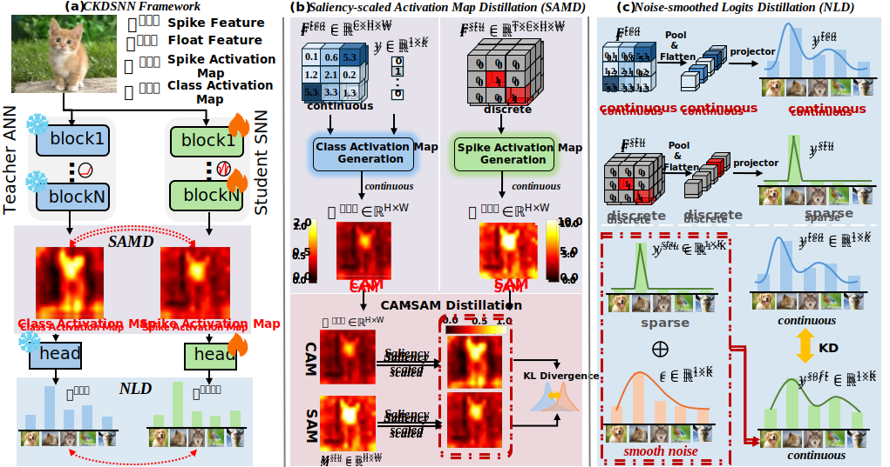

<div align="center"><h1>&nbsp;A Closer Look at Knowledge Distillation in Spiking Neural Network Training</h1></div>

<p align="center">
| <a href="http://arxiv.org/pdf/2407.09083"><b>Paper</b></a> | <a href="http://arxiv.org/pdf/2407.09083"><b>Blog</b></a> |
</p>

<p align="center">
  <a href="https://opensource.org/license/mulanpsl-2-0">
    
  </a>
  <a href="https://github.com/">
    
  </a>
  <a href="https://github.com/">
    
  </a>
</p>

## Contents

- [Contents](#contents)
- [News](#news)
- [Introduction](#introduction)
- [Usage](#usage)
  - [Installation](#installation)
  - [Preparation](#preparation)
    - [For Dataset: Prepare ImageNet1K, CIFAR-10, CIFAR-100 and CIFAR10-DVS.](#for-dataset-prepare-imagenet1k-cifar-10-cifar-100-and-cifar10-dvs)


## News
- [2025/11] Code of CKDSNN is released!

-----

## Introduction



-----

This is the official project repository for A Closer Look at Knowledge Distillation in Spiking Neural Network Training, which has been accepted by AAAI2026. If you find this repository helpful, Please kindly cite:

```
@inproceedings{
liucloser2026,
title={A Closer Look at Knowledge Distillation in Spiking Neural Network Training},
author={Xu Liu and Na Xia and Jinxing Zhou and Jingyuan Xu and Dan Guo},
booktitle={The 40th Annual AAAI Conference on Artificial Intelligence},
year={2026}
}
```

## Usage

### Installation
```ssh
pip install lightning
```

### Preparation

#### For Dataset: Prepare ImageNet1K, CIFAR-10, CIFAR-100 and CIFAR10-DVS.

